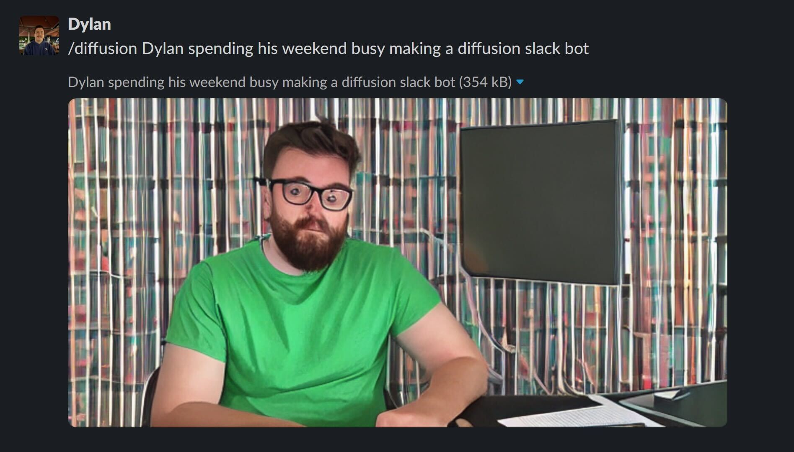

# Slack Diffusion

Slack bot for generating images using [Stable Diffusion](https://stability.ai/blog/stable-diffusion-public-release)

## Usage

```sh
$ docker build -t diffusion-slack .

$ docker run --rm --gpus=all \
  -v huggingface:/home/huggingface/.cache/huggingface \
  -v ~/.config/gcloud:/home/huggingface/.config/gcloud \
  --env-file docker.envs \
  diffusion
```

### WIP



### Based on works by

- [jamesrom/discord-diffusion](https://github.com/jamesrom/discord-diffusion)
- [fboulnois/stable-diffusion-docker](https://github.com/fboulnois/stable-diffusion-docker)
